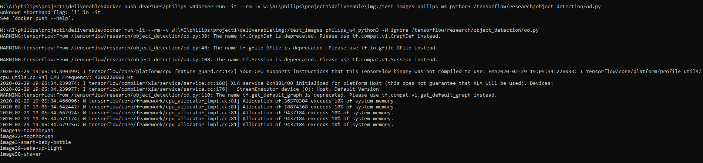

# Philips image recognition
This repository provides an instruction on how to obtain and run my tech xperience entry as well as a brief explanation of what was my approach.
The task was to create a classification algorithm that detects 4 classes: smart-baby-bottle, shaver, toothbrush, wake-up-light.

## My approach
Judging by the task description, it's aimed mostly towards few shot learning, however the rules allow for extending training data and there's no rule about not using pre existing code either. Thus, I've decided to extend the training data using videos available online and to use transfer learning to speed up the training process considerably.

I used [tensorflow's object detection api](https://github.com/tensorflow/models/tree/master/research/object_detection) with the pre-trained faster_rcnn_resnet50 model that has been trained on the coco dataset as the basis for my model. So, if needed, the program can also output images with rectangles around the objects as well. 
It may be a bit of an overkill, but it has been an interesting exercise in image recognition for me. 

## How to pull the docker image
Simply write `docker pull drarturs/philips_w4` and pull the image.

## How to run the program
Just run the image using the following command:

`docker run -it --rm -v <folder with test images>:/test_images philips_w4 python3 -W ignore /tensorflow/research/object_detection/od.py`

As an example, on my system I've been writing:

`docker run -it --rm -v W:\AI\philips\project1\deliverable\img:/test_images philips_w4 python3 -W ignore /tensorflow/research/object_detection/od.py`

## Optimization concerns
The program runs somewhat slowly - it takes around 30 seconds for each image, and the image is somewhat hefty in its size - around 2.8gb. However, I didn't see any restrictions regarding speed and memory, so it should be okay.

## Example image

